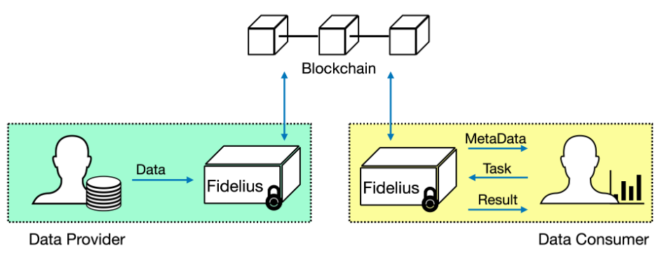

中文 / [English](../README.md)

# Fidelius - 熠智隐私计算中间件
## 引言
为了赋能企业间的数据合作，助力企业利用数据提升自身核心竞争力，熠智科技推出了面向数据合作的一站式隐私保护解决方案 Fidelius。Fidelius 基于“数据可用不可见”思想，有效保证了原始数据的一致性、计算逻辑的可控性、计算结果
的正确性及隐私性。

下图描述了基于 Fidelius 实现数据合作的抽象流程。与传统的数据合作模式类似，参与方包括了数据提供方和数据使用方。Fidelius 中间件分别运行在数据提供方和数据使用方中，双方通过与 Fidelius 交互实现数据合作操作。数据提供
方和数据使用方之间没有直接的数据交互，并且原始数据不会离开数据提供方的 Fidelius 中间件，这从根本上避免了隐私数据泄露的问题。



相比传统的数据合作模式，Fidelius 引入了区块链网络。由于区块链本身具有去中心化网络、公开可验证等特性，Fidelius 将其作为可信的传输通道和数据计算验证平台。

**注意：** 这是一个社区版本。尽管它与我们的企业版共享相似的组件，但它有不同的特性。了解企业版更多信息，请联系`contact@yeez.tech`。

## 文档
- [Fidelius: YeeZ Privacy Protection for Data Collaboration - A Blockchain based Solution](https://download.yeez.tech/doc/Fidelius_Introduction.pdf)

## 编译 Fidelius
### 环境依赖
- 确保拥有如下操作系统：
  * Ubuntu 20.04 LTS Server 64bits

- 确保 BIOS 和 CPU 启用 SGX，请遵循 [SGX-hardware](https://github.com/ayeks/SGX-hardware) 中的 [README.md](https://github.com/ayeks/SGX-hardware/blob/master/README.md) 。

- 按照 [linux-sgx](https://github.com/intel/linux-sgx) 项目中 [README.md](https://github.com/intel/linux-sgx/blob/master/README.md) 文档进行编译并安装`Intel(R) SGX`驱动`SDK`和`PSW`。

- 安装依赖工具（protobuf，glog，boost，cppconn等）：
```
$ sudo apt install build-essential ocaml ocamlbuild automake autoconf libtool wget python libssl-dev git cmake perl
$ sudo apt install libssl-dev libcurl4-openssl-dev protobuf-compiler libprotobuf-dev debhelper cmake reprepro unzip
$ sudo apt install mysql-server libgoogle-glog-dev libboost-all-dev libmysqlcppconn-dev
```
### 源码编译 Fidelius
```
$ git clone https://github.com/YeeZTech/YeeZ-Privacy-Computing.git
$ git submodule update --init
$ cd YeeZ-Privacy-Computing && mkdir build
$ cmake -DSGX_MODE=Debug -DSGX_HW=OFF ../
$ make -j8
```
**注意：** 开发者可以根据需求修改编译选项，例如 Release 版本的编译选项应修改为`SGX_MODE=Release`与`SGX_HW=ON`。

## 安装 Fidelius
请参考 Fidelius 安装[文档](INSTALL_ZH.md)。

## 授权
`YeeZ-Privacy-Computing`库(即`toolkit`目录下的所有代码) 根据 [Apache License 2.0](https://www.apache.org/licenses/LICENSE-2.0) 获得许可，同时也包括我们存储库中的`COPYING.APACHE`文件。

`YeeZ-Privacy-Computing`二进制文件(即`toolkit`目录下的所有代码) 根据 [GNU General Public License v3.0](https://www.gnu.org/licenses/gpl-3.0.en.html) 获得授权，同时也包括我们存储库中的`COPYING`文件。
